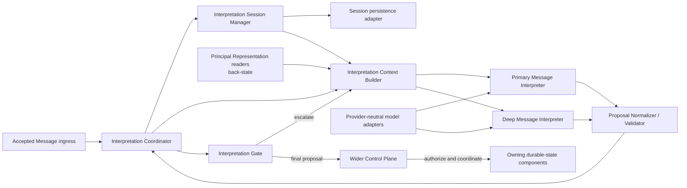

# Message Interpretation Structure

- Path: `ctx/docs/architecture/structure.md`
- Changed: `20260717`

## Purpose

Defines the target component responsibilities and dependency direction of the Message Interpretation subsystem.

## Target Component Map

### Interpretation Coordinator

Coordinates one interpretation attempt. It asks the Session Manager for deterministic pre-session evidence, requests a continuation or clean new-session context, runs Primary, invokes the Gate, triggers escalation, selects or produces the final proposal, and returns processing metadata.

When a proposal produced in the provisional current-session context says `start_new`, the Coordinator treats it only as a request to rebuild context and reinterpret the Message. It does not accept that proposal's semantic reading as final. The Coordinator does not own durable Principal Representation, execute resulting work, or commit durable effects.

### Interpretation Session Manager

The Control Plane's semantic owner for exactly one current logical Interpretation Session. It defines and enforces the session lifecycle, `continue | start_new` transition rules, current conversational frame, recovery rules, and provider-session subordination. It exposes current state and uses a persistence port, but a store that holds the record does not own those semantics.

The manager may create a candidate new-session frame for context construction. It finalizes a persisted lifecycle update only after the resulting proposal passes interpretation policy and the wider Control Plane authorizes the relevant transition.

### Interpretation Context Builder

Reads explicit relevance projections and creates the smallest sufficiently informative Interpretation Context. For a continuation it may include useful local session history. For a new-session context it excludes that prior local history and instead selects relevant Principal Model and Principal State projections, the current Message, trigger context, relevant durable Cases and decisions, and explicitly referenced Messages or events. A referenced old Message does not make the attempt a continuation.

### Primary Message Interpreter

The default low-latency, model-assisted path. It interprets common, short, and connected exchanges in prepared context, returns a compact structured proposal, and reports ambiguity or missing context rather than hiding it.

### Proposal Normalizer / Validator

Parses provider output, normalizes provider-specific forms into the common proposal schema, rejects unknown enum values and missing required fields, and preserves provider diagnostics separately from domain meaning. Structural normalization makes a session outcome usable for routing; it never makes the proposal authoritative.

### Interpretation Gate

Assesses whether a normalized proposal is sufficient under the selected session transition. It chooses `accept`, `clarify`, `escalate`, or `fail`; it neither authorizes actions nor commits Signals. A proposal from a provisional current-session context that requested `start_new` bypasses final acceptance and is reinterpreted in clean context first.

### Deep Message Interpreter

The escalation path for difficult or consequential interpretation. It may use a stronger model, more reasoning budget, extended context, additional retrieval, more time, or another configuration. Where practical, it starts independently from the Primary result to reduce anchoring. Its result is normalized, compared or arbitrated against the relevant Primary result, and evaluated through the Gate before it can become final.

## Dependency Direction

The subsystem depends on state-reader, session-persistence, and model-client contracts, never on provider state as truth. It emits a provisional proposal to wider Control Plane validation. The Control Plane then coordinates authorized effects with their durable owners; `back-state`, `back-exec`, `comm`, and the server composition root do not become dependencies of the core just because their data or integration is relevant.

## Current Module Mapping

The exploratory `src/Plane.mjs` collapses Coordinator, Session Manager shortcut policy, Context Builder, Gate, and model invocation into one component. `src/Proposal.mjs` performs a partial normalizer/validator role. The `src/Adapter/` modules are deterministic in-memory and scripted test adapters, not target production adapters. No current source module implements accepted ingress, semantic session-transition detection with re-interpretation, provider-session reuse, durable state ownership, or execution coordination.
