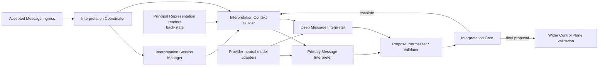

# Message Interpretation Structure

- Path: `ctx/docs/architecture/structure.md`
- Changed: `20260717`

## Purpose

Defines the target component responsibilities and dependency direction of the Message Interpretation subsystem.

## Target Component Map

### Interpretation Coordinator

Coordinates one interpretation attempt. It requests session and Principal context, runs Primary, invokes the Gate, triggers escalation, selects or produces the final proposal, and returns processing metadata. It does not own durable Principal Representation or execute resulting work.

### Interpretation Session Manager

Maintains exactly one current logical Interpretation Session. It exposes current state, applies `continue` or `start_new`, preserves the local conversational frame, and keeps provider-specific state subordinate to Alarisa-owned logical state. It supports recovery after a provider session is lost.

### Interpretation Context Builder

Reads explicit state projections and creates the smallest sufficiently informative Interpretation Context. It distinguishes continuation from a new session, does not load the entire representation blindly, does not use a previous textual summary as the primary new-session foundation, and may expand context for Deep interpretation.

### Primary Message Interpreter

The default low-latency, model-assisted path. It interprets common, short, and connected exchanges in prepared context, returns a compact structured proposal, and reports ambiguity or missing context rather than hiding it.

### Proposal Normalizer / Validator

Parses provider output, normalizes provider-specific forms into the common proposal schema, rejects unknown enum values and missing required fields, and preserves provider diagnostics separately from domain meaning.

### Interpretation Gate

Assesses whether a normalized proposal is sufficient. It chooses `accept`, `clarify`, `escalate`, or `fail`; it neither authorizes actions nor commits Signals.

### Deep Message Interpreter

The escalation path for difficult or consequential interpretation. It may use a stronger model, more reasoning budget, extended context, additional retrieval, more time, or another configuration. Where practical, it should start independently from the Primary result to reduce anchoring.

## Dependency Direction

The subsystem depends on state-reader and model-client contracts, never on provider state as truth. It emits a provisional proposal to wider Control Plane validation. `back-state`, `back-exec`, `comm`, and the server composition root do not become dependencies of the core just because their data or integration is relevant.

## Current Module Mapping

The exploratory `src/Plane.mjs` collapses Coordinator, Session Manager policy, Context Builder, Gate, and model invocation into one component. `src/Proposal.mjs` performs a partial normalizer/validator role. The `src/Adapter/` modules are deterministic in-memory and scripted test adapters, not target production adapters. No current source module implements accepted ingress, provider-session reuse, durable state ownership, or execution coordination.
