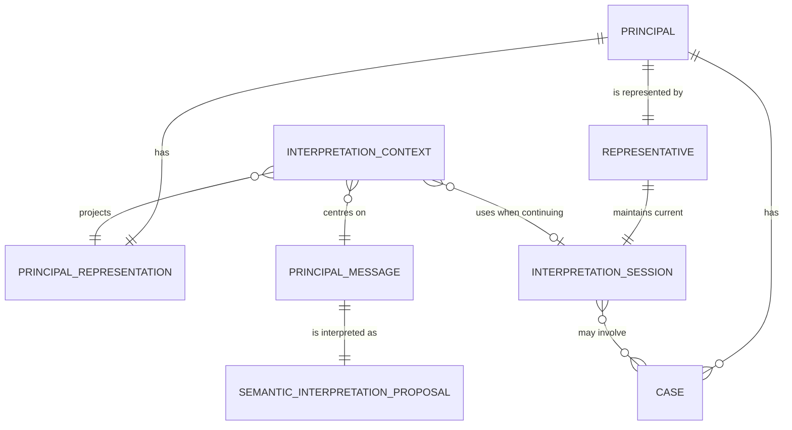

# Control Plane Domain Model

- Path: `ctx/docs/product/domain.md`
- Changed: `20260717`

## Purpose

Defines the product objects and relations that the Control Plane must preserve. This is a conceptual model, not a storage schema, provider prompt, API contract, or source-module design.

## Principal and Representative

One Alarisa instance serves exactly one **Principal**. The Principal has exactly one **Representative**, Alarisa. The Representative must preserve continuity with the Principal's way of thinking, current situation, intentions, and activity. Cases do not create further representatives or independent conversations.

## Core Objects and Relations

- A **Case** is a Principal attention and activity object. One session may involve zero, one, or many Cases; one Case may participate in many sessions over time.
- **Principal Representation** is the structured representation that lets Alarisa represent this particular Principal. It comprises a relatively stable Principal Model and dynamic Principal State.
- A **Principal Model** may express durable intentions and goals, preferences, constraints, decision patterns, terminology, and working style.
- **Principal State** may express current activity, active Cases, accepted decisions, priorities, open loops, pending questions, expected events, focus, and next-move ownership.
- An **Interpretation Session** is the one current logical frame of communication and mutual understanding between Principal and Representative. Its local history can preserve references, pronouns, temporary alternatives, and unresolved meaning while it continues.

## Message, Context, Proposal, and Signal

A **Principal Message** is meaningful input from the Principal. Transport acceptance, authentication, and durable intake may occur before interpretation. The accepted Message is evidence of communication; it is not yet an authoritative semantic update.

An **Interpretation Context** is a temporary, purpose-built view supplied to one model interpretation. It is neither the full Principal Representation nor durable memory. It may include interpreter instructions, relevant model and state projections, the current session, connected Messages, a conversational frame, relevant Cases, pending questions, expected next move, trigger and reply metadata, UI context, and the current Message. The Context Builder must select the smallest sufficient context.

A **Semantic Interpretation Proposal** is a provisional structured reading of a Message. It can include session outcome, meaning, intent, entities, Cases, proposed semantic changes, candidate Signals, ambiguity, missing context, recommended next move, evidence, and processing metadata. A **Signal** is not the raw Message or a candidate field: it is an authoritative semantic exchange only after Control Plane validation and application.

## Session Continuity

There is exactly one current logical Interpretation Session. For every incoming Message, the session-level outcome is either `continue` or `start_new`.

Time distance, `replyTo`, UI location, trigger metadata, and topic similarity are evidence for that decision; none is absolute. A delayed explicit reply may begin a new session, a rapid topic switch may begin a new session, and movement across related Cases may remain within the same session.

A new session starts from relevant Principal Representation, Principal State, trigger context, and the current Message. It never starts semantically empty, but a previous-session textual summary is not its primary bridge. Durable structured state must assimilate important previous results. An old summary may exist for diagnostics or review only.

## Ownership and Authority

`alarisa-back-state` owns durable Principal Representation and state. `alarisa-back-control` reads relevant projections and manages the interpretation responsibility, but must not make a model adapter the durable-state owner. `alarisa-back-exec` owns execution. Shared message contracts belong to `alarisa-comm-*`; the server composition root owns global transport composition.

The Control Plane validates and applies proposed meaning before any authoritative Signal or state effect. A model output, worker result, provider session, or Case cannot bypass that responsibility.

## Domain Invariants

- Principal Representation is distinct from the temporary Interpretation Context.
- No Case owns the current Interpretation Session and no multiple-active-session model exists.
- Local current-session history is useful for continuation; structured Principal state is the primary bridge to a new session.
- The interpreter may propose candidate Signals but never commits them.
- Provider-specific state is subordinate to package-controlled logical state.
